<h3><code>gavriel@github ~ $ ./contributions.sh</code></h3>

  

<h3><code>gavriel@github ~ $ whoami</code></h3>

<table>
  <tr>
    <td valign="top"></td>
    <td valign="top"></td>
  </tr>
</table>

<h3><code>gavriel@github ~ $ ./links.sh</code></h3>

<a href="https://www.linkedin.com/in/gavriel-fernandez-Linkdin">LinkedIn</a>&nbsp;&nbsp;|&nbsp;&nbsp;<a href="https://github.com/GavrielFernandez">GitHub</a>

<!--
Setup:
1. Create a public repository named exactly GavrielFernandez.
2. Copy these files to that repository and push them to main.
3. In Actions, run "Update profile art" once. It will refresh the heatmap every day.
4. To replace the temporary GF portrait, add a square-ish `source-photo.jpg`, run `python -m pip install -r scripts/requirements-local.txt`, then run `python scripts/make_ascii_portrait.py`.
-->